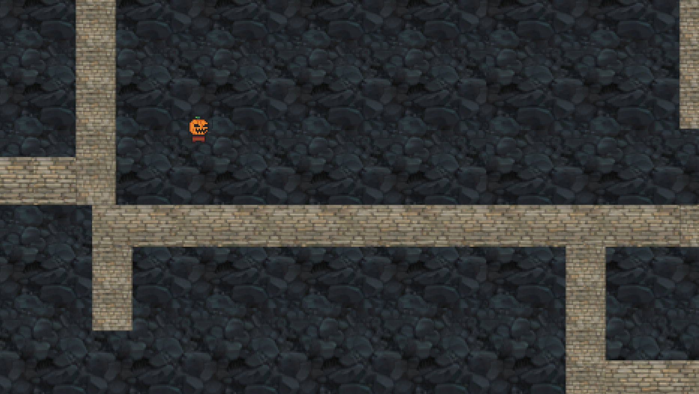

#Hide&Seek🎮



**_You can install the game using insructions below_**

Create a dir

```
$ go get github.com/YarikRevich/Hide-Seek-with-Guns
```

Go to sources
```
$ cd $(go env GOPATH)/src/github.com/YarikRevich/Hide-Seek-with-Guns
```

Use GNU Make

```
$ make 
$ make build
$ make install
```

Run and enjoy the game👌

```
$ HideSeek
```

Use 

```
$ HideSeek --help
```

To see all available flags

😊 If you want to contribute you definetily should use [debug cli](DEBUG.md)


